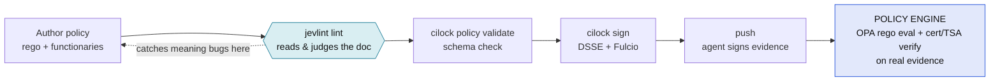
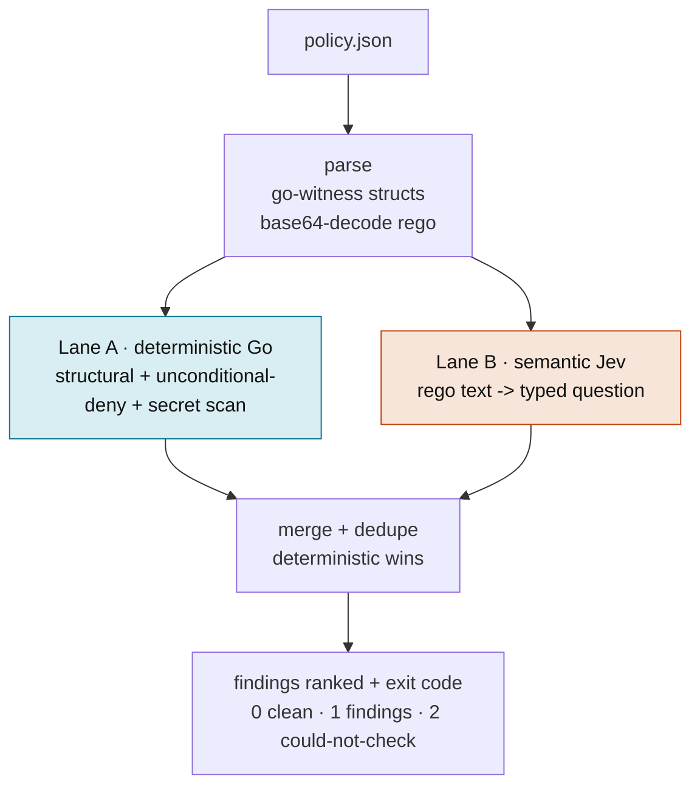
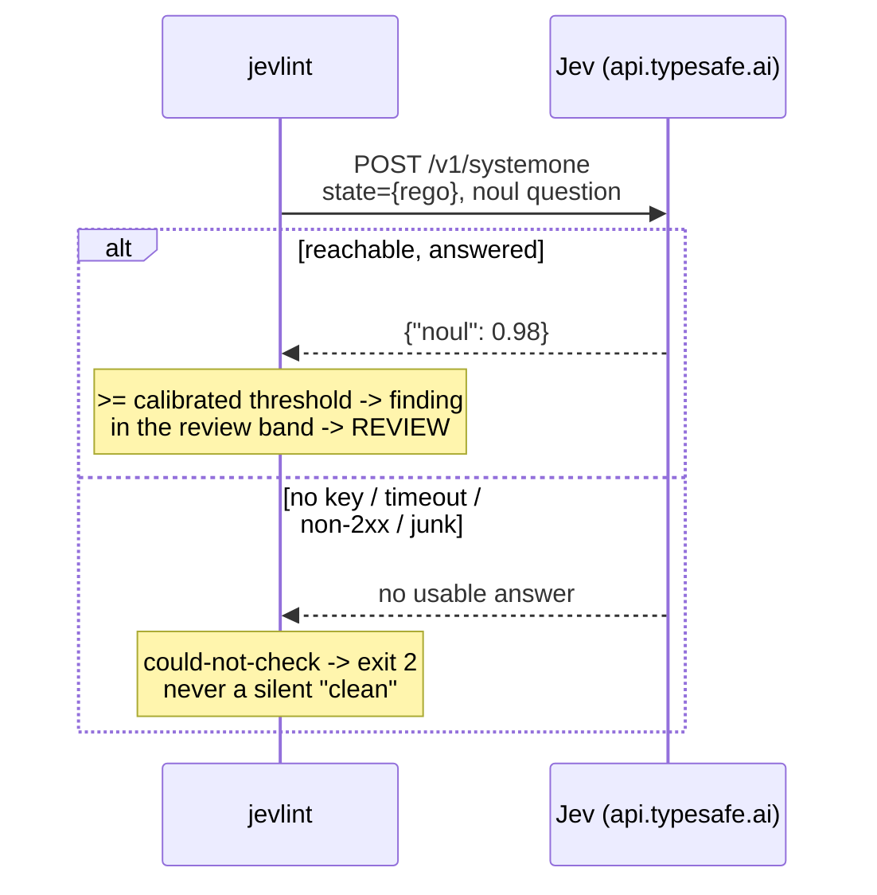
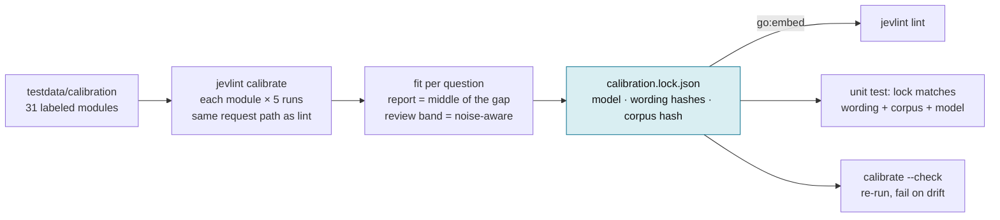
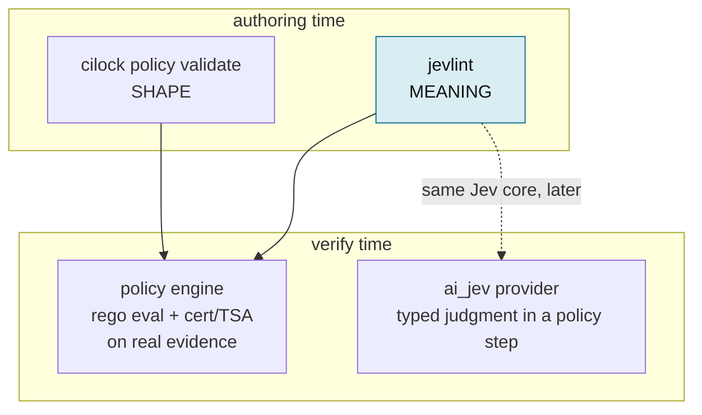

# jevlint architecture

## What it is

`jevlint` is a **pre-sign linter** for witness / cilock / pushgate policies. It reads
a policy document and tells you whether it will refuse every push, admit every
tenant, verify nothing, leak a secret, or quietly got weaker than the last
release — **before you sign it**.

It is **not** a policy engine. It never evaluates Rego, never verifies a
certificate chain, never checks a timestamp. That engine runs later, at verify
time, inside cilock and pushgate. jevlint reads the policy the way a reviewer
would; the engine runs it against real evidence.

Two lanes do the work:

- **Deterministic (Go).** Structural checks, an unconditional-deny heuristic, and
  a secret scanner. No network, never fails open. Runs with `--structural-only`.
- **Semantic (Jev).** The decoded Rego is sent to [TypeSafe Jev](https://typesafe.ai)
  as a *typed question* — the judgment a schema validator can't make. Jev reads
  the Rego as text; it never executes it.

## Where it sits



`cilock policy validate` checks the policy's **shape**. The engine only runs its
**meaning** at verify time, against real evidence — where a broken rule surfaces
as "every push denied", far from where the mistake was made. jevlint reads the
meaning at authoring time, so the mistake is caught where it is cheap to fix.

## How it works



The split is the design: anything security-critical that can be decided from the
document is deterministic, so an outage can never downgrade it to "looks fine".
Jev is used only where a schema validator is blind. When both flag the same
unconditional deny, the deterministic one wins and it reports once.

## Lane A — deterministic, never fails open

Pure Go over the parsed policy; runs offline. Three kinds:

- **Structural** — missing `roots` / `timestampauthorities` (only when a
  functionary is cert-based; a public-key policy needs neither), missing
  intermediates, expiry, a step with no functionary, a SPIFFE URI wildcard not
  scoped to `/tenant/<id>/`, and `certConstraint.roots: ["*"]` (trusts any root).
- **Unconditional-deny heuristic** — a `deny` block whose body has no condition on
  the input (only a `msg :=`) fires on every evaluation, so no evidence can pass.
- **Secret-in-policy** — a private key or an `AKIA…`/`ghp_…`/Slack/Google token
  embedded anywhere in the policy. Near-zero false positives; a public cert is fine.

## Lane B — how Jev judges Rego without executing it



A `noul` is a calibrated 0–1 probability. Jev answers two questions per Rego
module — **unconditional deny** and **underspecified check** (reads a field it
never compares) — plus, with `--context`, whether the policy is **over-scoped**
for the repo. Jev **fails open by contract**: any non-answer becomes
`could-not-check` and exit 2, never a pass.

## Batching and concurrency

The Jev API takes **one shared `state` per request**. So there are two different
things "batching" can mean, and they behave very differently:

- **Same-state batching** — many questions about *one* module in one request.
  This is what DeepEval does (every claim judged against one set of truths).
  jevlint does it by default: each module's two questions share one request.
- **Cross-state merging** — several *different* modules packed into one request,
  each at a named field (`module_00`, `module_01`, …).

```mermaid
flowchart LR
    subgraph default[default: one module per request, run in parallel]
        M1[module A: 2 questions] --> R1((req))
        M2[module B: 2 questions] --> R2((req))
        M3[module C: 2 questions] --> R3((req))
    end
    subgraph merged[opt-in --batch-size N: modules merged]
        MA[module A] --> RM((one req))
        MB[module B] --> RM
        MC[module C] --> RM
    end
    style default fill:#e0efe4,stroke:#15803d,color:#111
    style merged fill:#f7e5da,stroke:#c2410c,color:#111
```

**Measured** (jev-1.13.0, 2026-09-23, calls from India, 2 runs per mode; the old
binary sent every question as its own request):

| workload | old binary | **default** (1/request, 6 in flight) | merged ×8 |
|---|---|---|---|
| real 12-module pushgate policy | 11–12s | **1.6–2.3s** | 1.4s |
| 12-module stress policy (4 unconditional, 4 underspecified, 4 clean) | 10–11s | **1.5–1.6s** | 1.0s |
| answers vs old, max \|Δp\| (noise floor 0.03–0.05) | — | **0.03–0.13** | 0.34–0.42 |
| verdicts at 0.70 vs old | — | **identical** | **missed 3 of 4 underspecified** |

Merging left `unconditional-deny` untouched — true positives held at 0.94–0.98
beside clean neighbours, no smearing. But it **suppressed `underspecified-check`**:
true positives fell from 0.72–0.92 (one per request) to 0.53–0.76 at 8 per request
and to 0.26 at 16. "Reads a field it never compares" needs a careful read of the
whole module, and that degrades when a dozen modules share the context.

So the default is one module per request, and the speed comes from
**concurrency** — the same requests run serially took 6.1–6.8s. Concurrency
changes nothing Jev sees, and cost is unchanged either way: Jev bills input
tokens, and the same Rego is sent once in both designs.

A lone module is sent in the exact pre-batching shape (`state: {"rego": …}`, the
original wording). An earlier attempt that sent it behind an opaque field name
lost signal — a true unconditional deny fell from 0.86 to 0.64–0.67 and was
missed — and every single-module policy is a batch of one.

Failure handling: a failed request is retried once after a back-off (under
concurrency a failure is usually a 429); an oversize request is split in half so
one large module cannot sink the rest; an auth failure is final. A question that
still has no answer is `could-not-check`, never a pass.

## Calibration

A noul is a probability, but the point where it becomes a finding is a choice —
and one global `--min-prob 0.70` was never measured. Each question now has its
own threshold, fitted to a labeled corpus and locked.



**The corpus.** 31 Rego modules, each labeled for every question with a
one-line reason: the 12-module synthetic stress set, the Rego shipped in
`examples/`, a real pushgate policy, and hand-written hard cases (a guard that
is a helper rule always true, a `default` rule nothing overrides, an allowlist
defined but never applied, a field compared only inside a helper function).
Every unconditional-deny label was checked against `opa eval`: each positive
denies both an empty and a well-formed input, each negative passes the
well-formed one. Ambiguous shapes (a field read only to format a message) are
left out rather than guessed.

**The fit.** With positives and negatives separated, the report threshold is the
middle of the gap; if they overlap, it is the lowest score that still meets the
target precision. It is never below 0.50. The review band starts at the lower of
"highest negative + noise" and "lowest positive − noise", never below 0.35,
where noise is the widest run-to-run spread of any single module. The second
term matters: in one 3-run pass a hard underspecified module scored 0.46–0.69
across identical requests, and without it that positive was dropped, not
reviewed. Precision and recall are recorded at the threshold actually chosen.

**The lock vouches for exactly one thing:** the model, each question's exact
wording (a hash of the lone and batched phrasings and both criteria), and the
corpus bytes. `lint` uses a question's calibrated threshold only if its wording
hash matches, and otherwise falls back to `--min-prob` with a note. A unit test
fails on any mismatch, so it runs on every PR with no API key; `calibrate
--check` re-runs the corpus with a key and fails if precision or recall at the
locked thresholds fell more than `--tolerance`.

**What it changed.** Measured with the corpus, 5 runs each, the underspecified
question's original wording ("reads a field from the input but never compares
it") separated positives ≥ 0.55 from negatives ≤ 0.33 — a 0.22 margin (and its
weakest positive fell to 0.46 in an earlier 3-run pass). Naming the mechanism
("a value taken from `input` … assigned but never used in any condition of a
deny rule") gave positives ≥ 0.91 and negatives ≤ 0.33–0.35 — a 0.56–0.58
margin — in two separate fits, and an independent `--check` run held precision
and recall at 1.00 at the locked threshold. Unconditional-deny, asked in the same
requests, did not move (0.86–0.87 / 0.18). The wording was switched on that
evidence. The corpus is still small (8 underspecified positives) and partly
written by us; widening it with real policies is the way to trust these numbers
further.

## Check catalog

| check | lane | catches | grounded in |
|---|---|---|---|
| `unconditional-deny` | Go + Jev | a deny that refuses all evidence | heuristic + Jev |
| `secret-in-policy` | Go | private key / API token in the doc | regex |
| `wildcard-functionary` | Go | SPIFFE URI wildcard missing `/tenant/` | cilock agent SPIFFE scheme |
| `trusts-any-root` | Go | `certConstraint.roots: ["*"]` | go-witness constraints |
| `no-roots` / `no-tsa` | Go | cert-based policy missing trust anchors | gated on cert functionary |
| `no-intermediates` | Go | root cert with no intermediate | — |
| `expired` / `expiring-soon` / `no-expiry` | Go | stale or unbounded policy | — |
| `no-functionary` | Go | a step nothing may sign | — |
| `underspecified-check` | Jev | reads a field it never compares | — |
| `over-scoped` | Jev | demands evidence the repo can't produce | `--context` |
| diff: `check-dropped`, `functionary-widened`, `tsa-removed`, `rule-dropped`, `step-removed`, `roots-removed` | Go | a new release quietly weaker than the last | mirrors pushgate weakensRequirements |

## Usage

```
jevlint lint  <policy.json>            # structural + Jev
jevlint lint  <policy.json> --structural-only   # deterministic only; no key, no egress
jevlint lint  <policy.json> --type pushgate --context "README-only repo"
jevlint diff  <old.json> <new.json>    # flag where NEW is weaker than OLD
jevlint version
```

Config precedence is cobra + viper: **flag → env → config file → default**.

| flag | env | default |
|---|---|---|
| `--model` | `JEVLINT_MODEL` | `jev-1.13.0` |
| `--min-prob` | `JEVLINT_MIN_PROB` | calibrated per question (see Calibration); `0.70` fallback. Set explicitly, it applies to every question |
| `--calibration` | — | the lock compiled into the binary |
| `--api-key` | `TYPESAFE_API_KEY` / `JEVLINT_API_KEY` | file `~/.config/typesafe/api_key` → keychain |
| `--json` | `JEVLINT_JSON` | `false` |
| `--concurrency` | `JEVLINT_CONCURRENCY` | `6` |
| `--batch-size` | `JEVLINT_BATCH_SIZE` | `1` (above 1 lowers underspecified recall — see above) |

Every Jev run prints what it spent: `jev: 12 request(s) for 24 question(s),
batch size 1, concurrency 6`.

Exit codes: `0` clean · `1` findings (or weakenings) · `2` could-not-check or
error. The `2` maps onto a gate that must refuse rather than guess.

## Where it fits in the existing toolchain



- **Complements `cilock policy validate`.** validate proves the policy parses;
  jevlint proves it means something safe. Run both before signing.
- **Runs before `cilock sign` / a pushgate signing request.** It is the gate
  before the gate — catching the deny-everything, wildcard-functionary, or
  leaked-key mistakes that otherwise surface only as refused pushes in production.
- **Distinct from the policy engine.** The engine (OPA rego eval, cert chain, TSA)
  runs at verify time on real evidence. jevlint never does that work.
- **Shares its Jev approach with rookery's `ai_jev`.** `ai_jev` is the
  verify-time provider that lets a *policy step* ask Jev a typed question about an
  *attestation*; jevlint asks Jev typed questions about the *policy document* at
  authoring time. The triage core is designed so the same logic can later back an
  `ai_jev` check.
- **CI:** the bundled GitHub Action (`.github/workflows/policy-lint.yml`) lints
  every changed `*.policy.json` on a PR and diffs it against the base branch to
  catch a gate being quietly weakened.

## Verified against

Field names and semantics were checked against go-witness
(`aflock-ai/rookery attestation/policy`) and against real witness policies on
disk — a key-based `policy.json` and a cert-based Fulcio policy both lint clean.
jevlint asks Jev only where its strength (presence + intent) applies; it never
asks version/CVE questions, because Jev confuses a patched dependency with a
vulnerable one — that job belongs in `govulncheck` / `osv-scanner`.
