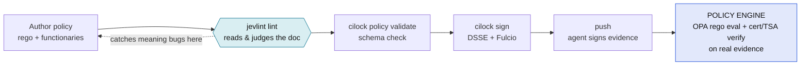
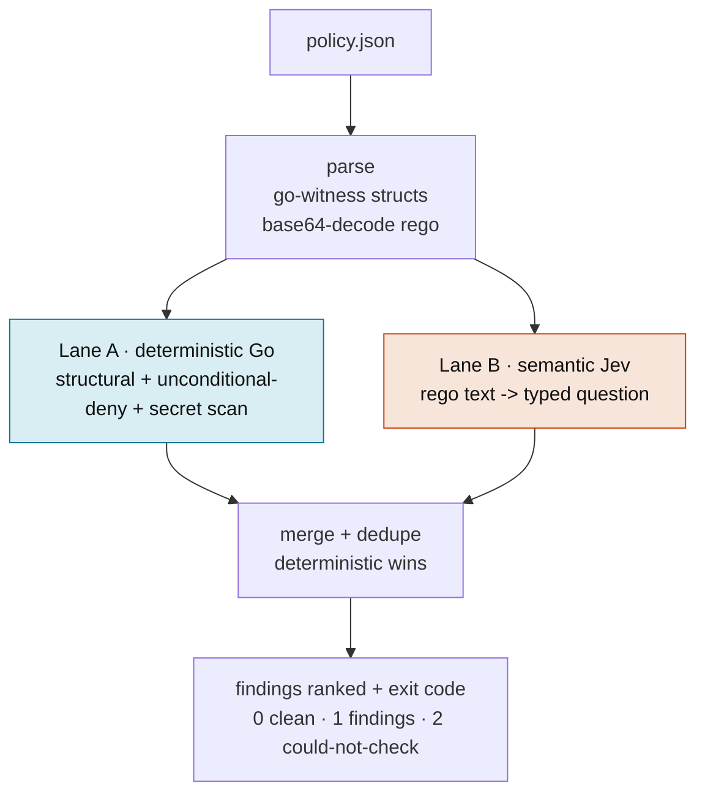
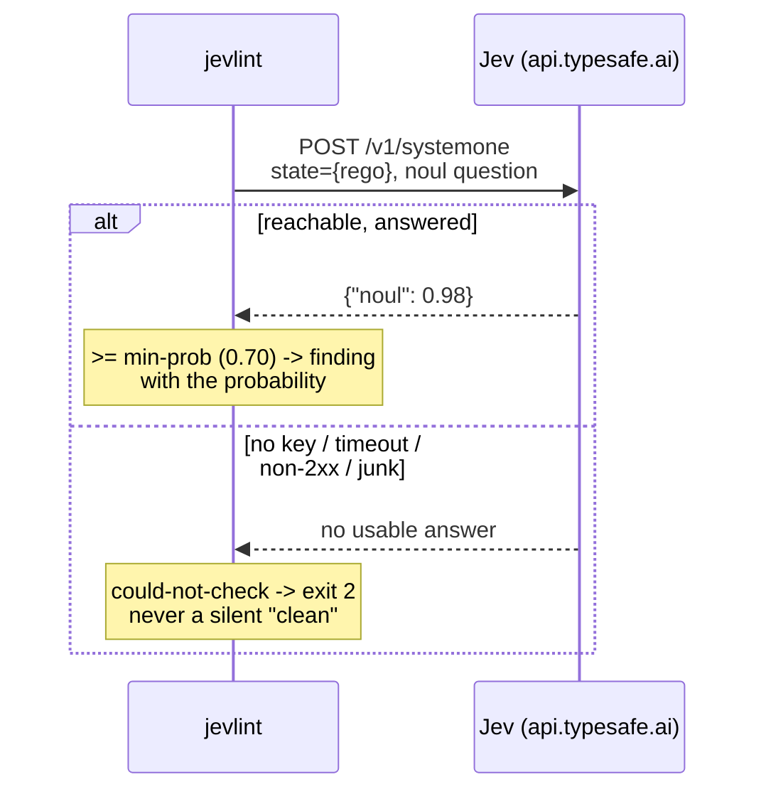
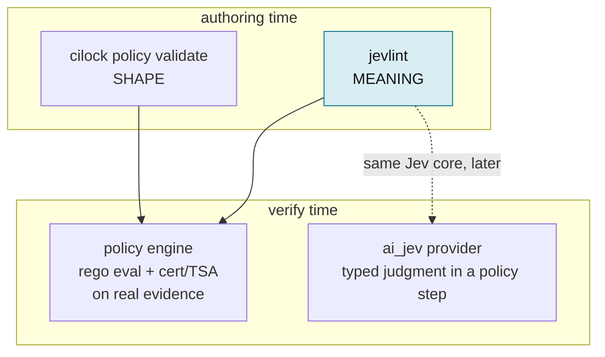

# jevlint architecture

## What it is

`jevlint` is a **pre-sign linter** for witness / cilock / pushgate policies. It reads
a policy document and tells you whether it will refuse every push, admit every
tenant, verify nothing, leak a secret, or quietly got weaker than the last
release — **before you sign it**.

It is **not** a policy engine. It never evaluates Rego, never verifies a
certificate chain, never checks a timestamp. That engine runs later, at verify
time, inside cilock and pushgate. jevlint reads the policy the way a reviewer
would; the engine runs it against real evidence.

Two lanes do the work:

- **Deterministic (Go).** Structural checks, an unconditional-deny heuristic, and
  a secret scanner. No network, never fails open. Runs with `--structural-only`.
- **Semantic (Jev).** The decoded Rego is sent to [TypeSafe Jev](https://typesafe.ai)
  as a *typed question* — the judgment a schema validator can't make. Jev reads
  the Rego as text; it never executes it.

## Where it sits



`cilock policy validate` checks the policy's **shape**. The engine only runs its
**meaning** at verify time, against real evidence — where a broken rule surfaces
as "every push denied", far from where the mistake was made. jevlint reads the
meaning at authoring time, so the mistake is caught where it is cheap to fix.

## How it works



The split is the design: anything security-critical that can be decided from the
document is deterministic, so an outage can never downgrade it to "looks fine".
Jev is used only where a schema validator is blind. When both flag the same
unconditional deny, the deterministic one wins and it reports once.

## Lane A — deterministic, never fails open

Pure Go over the parsed policy; runs offline. Three kinds:

- **Structural** — missing `roots` / `timestampauthorities` (only when a
  functionary is cert-based; a public-key policy needs neither), missing
  intermediates, expiry, a step with no functionary, a SPIFFE URI wildcard not
  scoped to `/tenant/<id>/`, and `certConstraint.roots: ["*"]` (trusts any root).
- **Unconditional-deny heuristic** — a `deny` block whose body has no condition on
  the input (only a `msg :=`) fires on every evaluation, so no evidence can pass.
- **Secret-in-policy** — a private key or an `AKIA…`/`ghp_…`/Slack/Google token
  embedded anywhere in the policy. Near-zero false positives; a public cert is fine.

## Lane B — how Jev judges Rego without executing it



A `noul` is a calibrated 0–1 probability. Jev answers two questions per Rego
module — **unconditional deny** and **underspecified check** (reads a field it
never compares) — plus, with `--context`, whether the policy is **over-scoped**
for the repo. Jev **fails open by contract**: any non-answer becomes
`could-not-check` and exit 2, never a pass.

## Check catalog

| check | lane | catches | grounded in |
|---|---|---|---|
| `unconditional-deny` | Go + Jev | a deny that refuses all evidence | heuristic + Jev |
| `secret-in-policy` | Go | private key / API token in the doc | regex |
| `wildcard-functionary` | Go | SPIFFE URI wildcard missing `/tenant/` | cilock agent SPIFFE scheme |
| `trusts-any-root` | Go | `certConstraint.roots: ["*"]` | go-witness constraints |
| `no-roots` / `no-tsa` | Go | cert-based policy missing trust anchors | gated on cert functionary |
| `no-intermediates` | Go | root cert with no intermediate | — |
| `expired` / `expiring-soon` / `no-expiry` | Go | stale or unbounded policy | — |
| `no-functionary` | Go | a step nothing may sign | — |
| `underspecified-check` | Jev | reads a field it never compares | — |
| `over-scoped` | Jev | demands evidence the repo can't produce | `--context` |
| diff: `check-dropped`, `functionary-widened`, `tsa-removed`, `rule-dropped`, `step-removed`, `roots-removed` | Go | a new release quietly weaker than the last | mirrors pushgate weakensRequirements |

## Usage

```
jevlint lint  <policy.json>            # structural + Jev
jevlint lint  <policy.json> --structural-only   # deterministic only; no key, no egress
jevlint lint  <policy.json> --type pushgate --context "README-only repo"
jevlint diff  <old.json> <new.json>    # flag where NEW is weaker than OLD
jevlint version
```

Config precedence is cobra + viper: **flag → env → config file → default**.

| flag | env | default |
|---|---|---|
| `--model` | `JEVLINT_MODEL` | `jev-1.13.0` |
| `--min-prob` | `JEVLINT_MIN_PROB` | `0.70` |
| `--api-key` | `TYPESAFE_API_KEY` / `JEVLINT_API_KEY` | file `~/.config/typesafe/api_key` → keychain |
| `--json` | `JEVLINT_JSON` | `false` |

Exit codes: `0` clean · `1` findings (or weakenings) · `2` could-not-check or
error. The `2` maps onto a gate that must refuse rather than guess.

## Where it fits in the existing toolchain



- **Complements `cilock policy validate`.** validate proves the policy parses;
  jevlint proves it means something safe. Run both before signing.
- **Runs before `cilock sign` / a pushgate signing request.** It is the gate
  before the gate — catching the deny-everything, wildcard-functionary, or
  leaked-key mistakes that otherwise surface only as refused pushes in production.
- **Distinct from the policy engine.** The engine (OPA rego eval, cert chain, TSA)
  runs at verify time on real evidence. jevlint never does that work.
- **Shares its Jev approach with `ai_jev` and `jade triage`.** `ai_jev` is the
  verify-time provider that lets a *policy step* ask Jev a typed question about an
  *attestation*; jevlint asks Jev typed questions about the *policy document* at
  authoring time. The triage core is designed so the same logic can later back an
  `ai_jev` check.
- **CI:** the bundled GitHub Action (`.github/workflows/policy-lint.yml`) lints
  every changed `*.policy.json` on a PR and diffs it against the base branch to
  catch a gate being quietly weakened.

## Verified against

Field names and semantics were checked against go-witness
(`subtrees/rookery/attestation/policy`) and against real witness policies on
disk — a key-based `policy.json` and a cert-based Fulcio policy both lint clean.
jevlint asks Jev only where its strength (presence + intent) applies; it never
asks version/CVE questions, because Jev confuses a patched dependency with a
vulnerable one — that job belongs in `govulncheck` / `osv-scanner`.
